## InstallTextのプラグインの使い方

### はじめに

このプラグインはMVとMZ共用です。

### プラグインの特徴

このプイラグインはRPGツクールでのシナリオ作成を補助するツールです。

プラグインコマンドを用いてテキストファイルを直接メッセージウィンドウに表示する機能のため、 デバックのときにゲームを再起動しなくてもテキストの内容が反映されます。
※スクロールウィンドウには対応していません。

また、本文中で2回以上連続改行による自動改ページ、特定の文字列を変数登録する機能によって、直感的で効率的なシナリオ作成を可能とします。

このヘルプではチュートリアル形式で使い方を説明していきます。

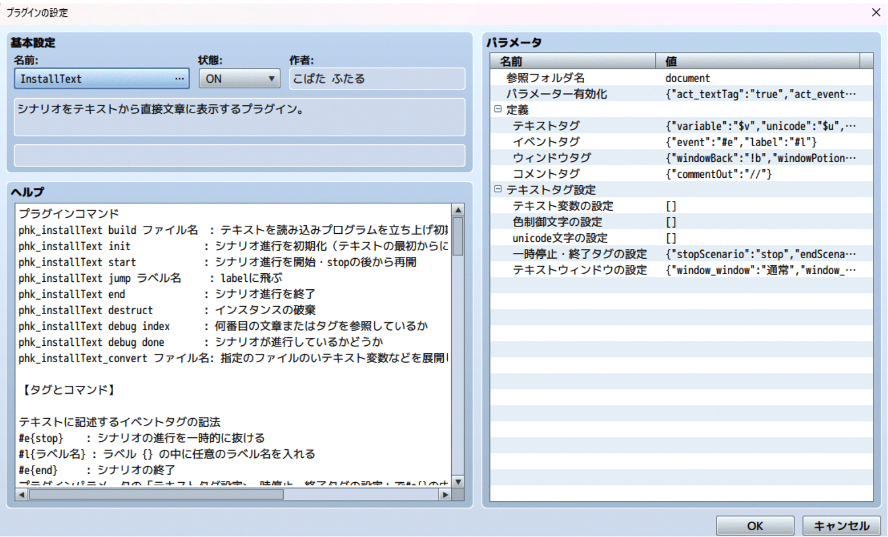


## プラグインを有効化しよう

一般的なプラグインの有効化の説明なので知ってる人は読み飛ばしてOK

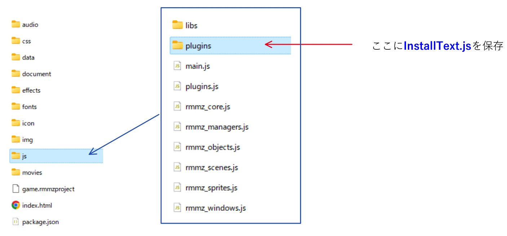

---


---

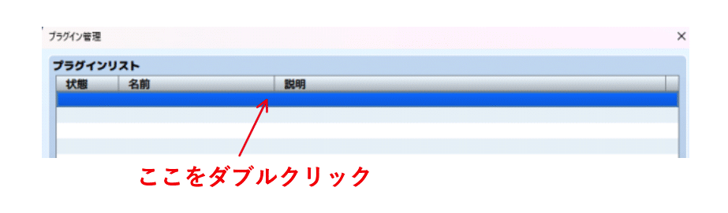

---

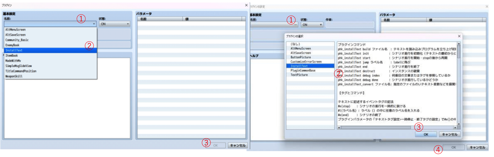


### テキストを保存するフォルダを指定しよう

まず「参照フォルダ名」というパラメーターを開いてみよう。

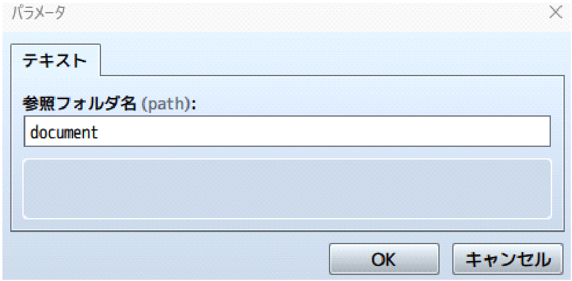

デフォルトはdocumentです。デフォルトで使用する場合はdocumentという名前のフォルダを プロジェクトフォルダ内に作成し、そこにテキストファイルを保存してくださいください。

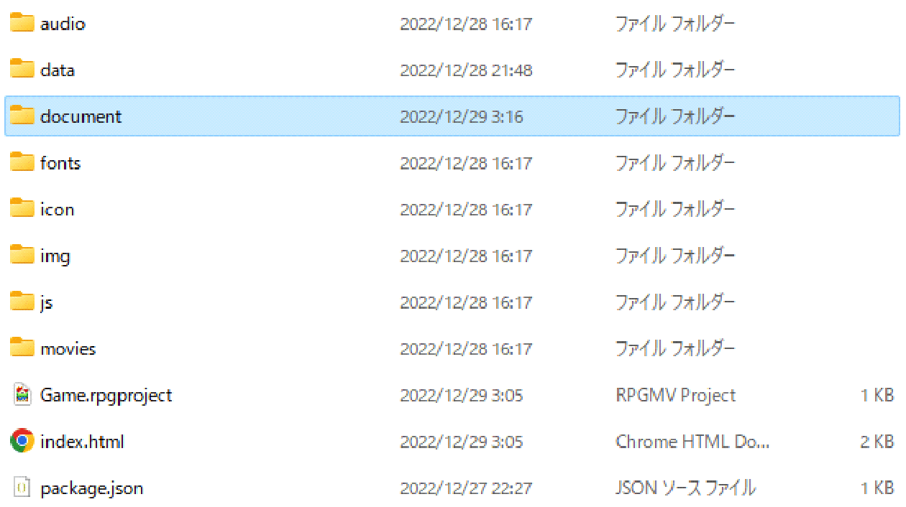

変更する場合は、テキストを保存するフォルダをプロジェクトフォルダ内に作成し、そのフォルダ名をパラメータ(参照フォルダ名)に入力してください。


## テキストを書いてみよう

ここからは実際にプラグインコマンドを使ってみます。

以下のテキストをコピペしたexample.txtを作成してdocumentフォルダ(参照フォルダ)に 保存してください。文字コードはutf-8で。


コピペ用テキスト

```
主人公
「このプラグインの使い方がわからないのよね」

??? 
「わかったぜ。今日はこの\c[1]プラグイン\c[0]について説明するぜ」
```

※行間が削除されてしまう場合はすいませんがうまく追加してください


### 次のページから説明する内容
- 文章の読み込みをしてみる 改ページのルール
- コメントアウト いったんテキストを抜けてイベントを挟む 選択肢とラベルジャンプ ウインドウの設定を変更してみる 顔グラをつけてみる
- 名前欄を使ってみる
- 変数を設定してみよう

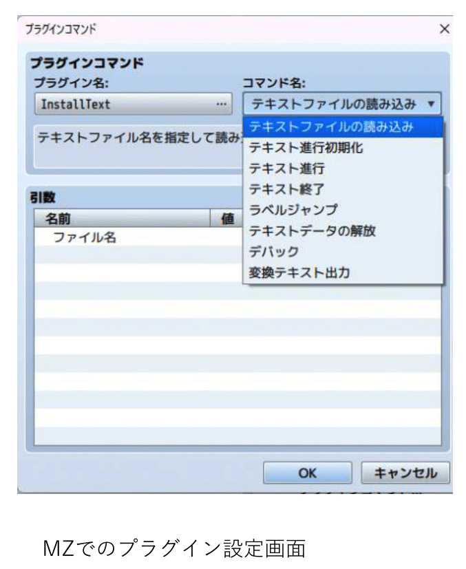


### 文章の読み込みをしてみる

イベントに以下のようにプラグインコマンドを設定してください。

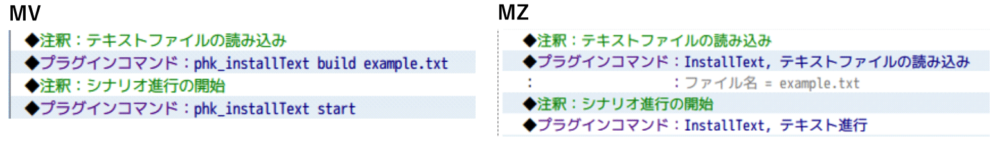

保存したらテストプレイを起動してイベントを実行してみてください。

#### 文章について

テキストに書かれた文章はそのまま表示されます。また制御文字もそのままの表記で使用できます

### 改ページのルール

文章が2回以上連続で改行れている(つまり行間が1行以上あいていると)と余分な改行は削
除されてそこで改ページされます。
あえてそれを回避したい場合は行間にスペース(空白文字)をいれてください。
もちろん5行以上の場合はツクールの仕様に基づき改ページとなります。

文章1  ......文章1で1ページ
文章2  ......文章2で1ページ
文章3 ......文章3~4の2行で1ページ 文章4
文章5  ......文章5~6の3行で1ページ
□    ......スペース
文章6


### コメントアウト

ここからはテキストコマンドを使用していきます。
以下の文章を追記して、イベントを実行してみてください。


//{}で囲われた部分はコメントアウト(注釈)となりメッセージには表示されません。 

例えば

文章1//{注釈}文章2 

としても//{}は除外されます。


### いったんテキストを抜けてイベントを挟む

まずは以下の文章を追記してください。


次に以下の赤枠をイベントに追加してください。 保存したらテストプレイを再起動(F5)してイベントを実行してください。


文中の#e{stop}でテキストをいったん抜けて、プラグインコマンドstart/テキスト進行で 途中から再開できます。
その間に文章以外のアクションを挟むことができます。


### 選択肢とラベルジャンプ

まずは以下の文章を追記してください。

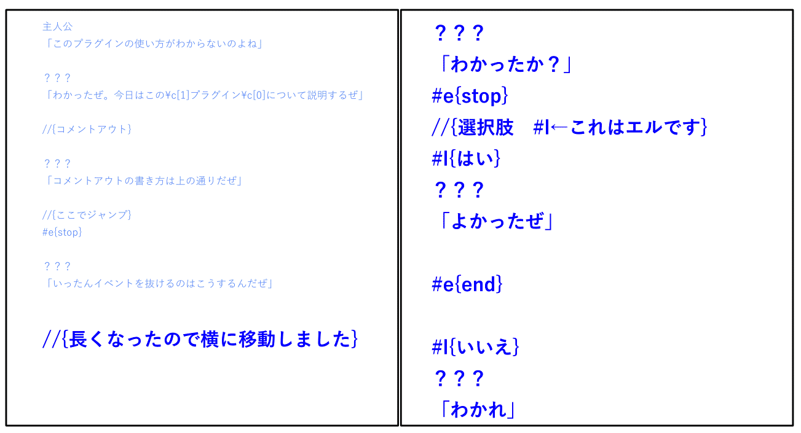

次に以下の赤枠をイベントに追加してください。 
保存したらテストプレイを再起動(F5)してイベントを実行してください。

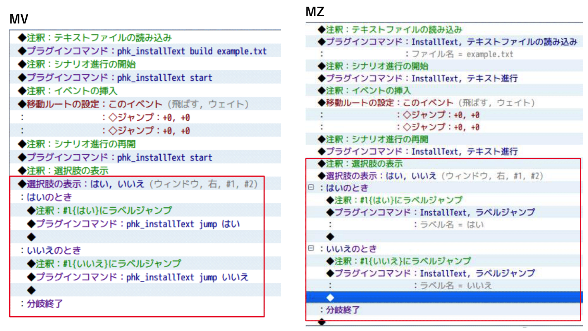

e#{stop}でいったん抜けた後、選択肢の表示を行い、それぞれプラグインコマンドjump/ラベルジャンプで 指定の#l{ラベル}に飛べます。
また、途中でシナリオを終了するには#e{end}を使用します。


### ウインドウの設定を変更してみる

まずは新しくexample2.txtを作成して以下をコピペして保存してください。 
文字コードはutf-8で。

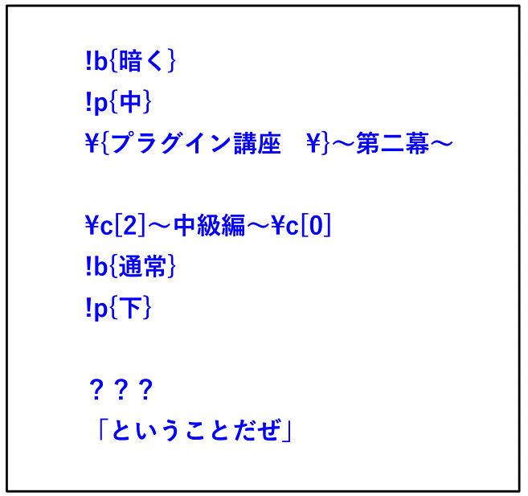

次に以下のイベントをマップに作成してください。
そしたら保存してテストプレイでイベントを実行してみてください。

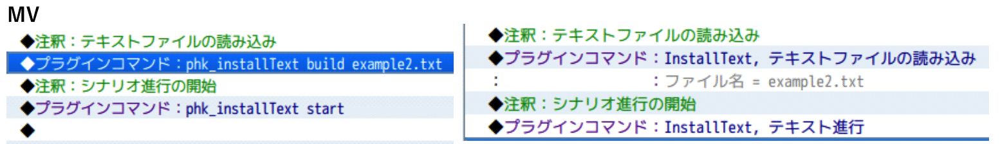

!b{通常/暗く/透明}でバックグラウンドを、!p{上/中/下}でウインドウの位置を変更できます。 

設定を行った次の行から有効になります。
また、新たに設定し直すまでこの設定はずっと有効になります。


### 顔グラをつけてみる

まずは以下の文章を追記してイベントを実行してください。

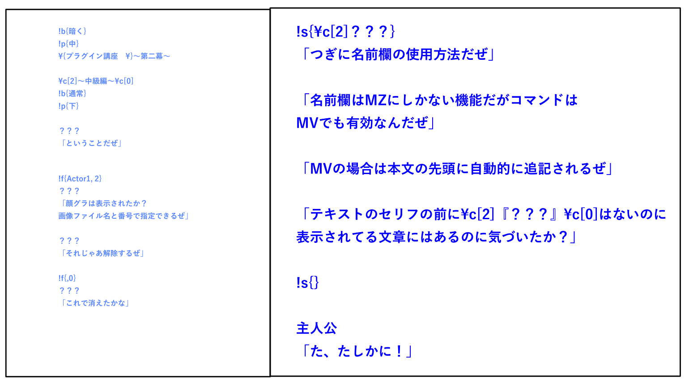

!f{画像ファイル名, 画像番号}でウインドウに顔グラをつけることができます。

 顔グラを消すには!f{,0}としてください。(コンマを忘れずに!)
こちらも新たに設定するまではずっと有効になります。


### 名前欄を使ってみる

まずは以下の文章を追記してイベントを実行してください。

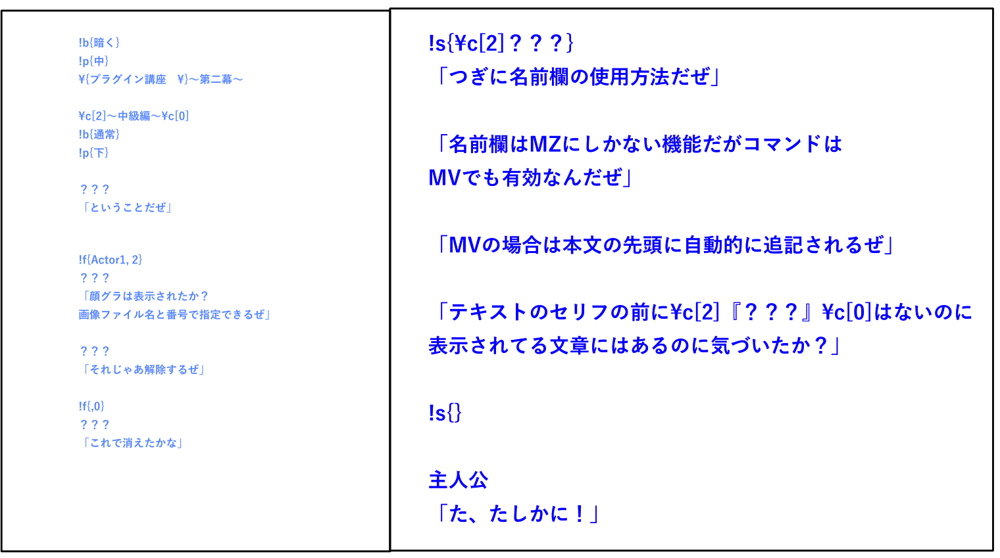

!s{名前}とすることでMZでは名前欄に「名前」を表示することができます。 
一方でMVでは文頭に自動的に名前が追加されます。

名前欄を消すには!s{}としてください。 

こちらも新たに設定するまではずっと有効になります。
そのため同じ人物が喋っているシーンでは記述量がぐっと減ります。


### 変数を設定してみよう

まずプラグイン>パラメータ>テキスト変数の設定を以下のように記述してください。
イコールは半角です。イコール前後のスペースはあってもなくてもいいです。

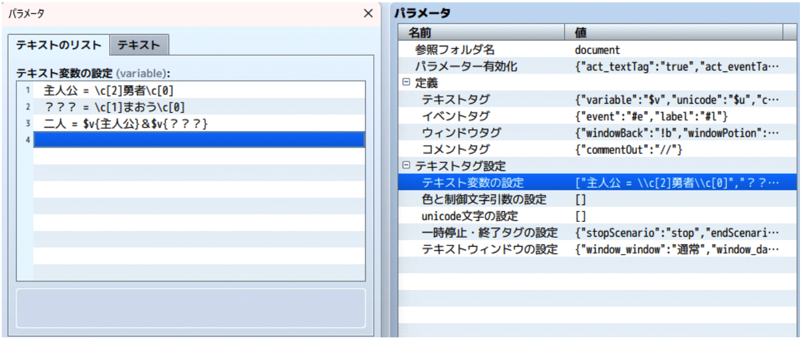

新しくexample2.txtを作成して以下をコピペして保存してください。文字コードはutf-8で。


次に以下のイベントをマップに作成してください。
そしたら保存してテストプレイでイベントを実行してみてください。

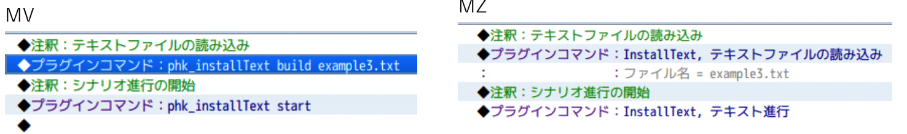

パラメータ>テキスト変数の設定で設定した変数はテキストで$v{変数名}で表記できます。 
またデフォルトで$c{青}などで色制御文字を、$u{変数名}で文字化けしやすいunicodeを表示でき この二つはデフォルトで設定されています。
それぞれの設定で変数の追加や変更ができます。


### 色制御文字$c{}一覧表

|        |             |              | 
| ------ | ----------- | ------------ | 
| ¥c[0]  | white       | 白           | 
| ¥c[1]  | lightblue   | 薄青         | 
| ¥c[2]  | lightred    | 薄赤         | 
| ¥c[3]  | lightgreen  | 薄緑         | 
| ¥c[4]  | lightcyan   | ライトシアン | 
| ¥c[5]  | lightpurple | 薄紫         | 
| ¥c[6]  | lightyellow | 浅黄         | 
| ¥c[7]  | gray        | 灰           | 
| ¥c[8]  | silver      | 銀           | 
| ¥c[9]  | blue        | 青           | 
| ¥c[10] | red         | 赤           | 
| ¥c[11] | green       | 緑           | 
| ¥c[12] | sky         | 空           | 
| ¥c[13] | purple      | 紫           | 
| ¥c[14] | yellow      | 黄           | 
| ¥c[15] | black       | 黒           | 
| ¥c[16] | aqua        | 水           | 
| ¥c[17] | lemon       | レモン       | 
| ¥c[18] | scarlet     | 紅           | 
| ¥c[19] | navy        | 紺           | 
| ¥c[20] | orange      | オレンジ     | 
| ¥c[21] | gold        | 金           | 
| ¥c[22] | cobalt      | コバルト     | 
| ¥c[23] | cyan        | シアン       | 
| ¥c[24] | lightlime   | ライトライム | 
| ¥c[25] | brown       | 茶           | 
| ¥c[26] | wistaria    | 藤           | 
| ¥c[27] | pink        | ピンク       | 
| ¥c[28] | darkgreen   | 濃緑         | 
| ¥c[29] | lime        | ライム       | 
| ¥c[30] | darkpurple  | 濃紫         | 
| ¥c[31] | violet      | 菫           | 


### テキストコマンド一覧


|  コマンド |  記法 |  引数({}の中) | 説明  | 
|---|---|---|---|
| 注釈           |  //{} | [任意の文字列]  | この部分は表示されない  |  
| イベント         |  #e{} |  stop/end | 文章の進行を一時停止/終了  |  
| ラベルジャンプ | #l{}  | [ラベル名]  | ジャンプ先のラベル  | 
| ウインドウ位置 | !p{}  | 上/中/下  | ウインドウ位置を設定  | 
| ウインドウ背景 | !b{}  |  通常/暗く/透明 |  ウインドウ背景を設定 | 
| ウインドウの顔グラ | !f{}  |  [画像ファイル名],[画像番号] | ウインドウの顔グラを設定  | 
| ウインドウの名前欄 | !s{}  | [任意の文字列]  |  ウインドウ名前欄を設定 | 
| ユーザー定義テキスト変数 | $v{}  | [任意の文字列]  |  変数の表示 | 
| 色制御文字テキスト変数 |  $c{} | [色の名前]  |  変数の表示 | 
| unicodeテキスト変数 | $u{}  |  [任意の文字列] |  変数の表示 | 


### プラグインコマンド一覧


| MV                       | MZ                         | 引数         | 説明                                                           | 
| ------------------------ | -------------------------- | ------------ | -------------------------------------------------------------- | 
| phk_installText build    | テキストファイルの読み込み | [ファイル名] | ファイル読み込み<br>初期化も同時に行う                         | 
| phk_installText init     | テキスト進行初期化         | -            | テキストの進行を最初からにする。                               | 
| phk_installText start    | テキスト進行               | -            | テキスト進行を開始する。 または#e{stop}の続きから再開する。    | 
| phk_installText end      | テキスト終了               | -            |  テキスト進行を終了する。                                      | 
| phk_installText jump     | ラベルジャンプ             | [ラベル名]   |  ラベルの行にジャンプする。                                    | 
| phk_installText destruct | テキストデータの解放       | -            | 読み込んだテキストデータを<br>イベントから削除する。           | 
| phk_installText debug    | デバッグ                   | index/done   | index:何番目のテキストを読んでるか done:テキスト進行中かどうか | 
| phk_installText convert  | 変換テキスト出力           | [ファイル名] | 文章の表示の一括入力用のテキストを生成、出力する。             | 

